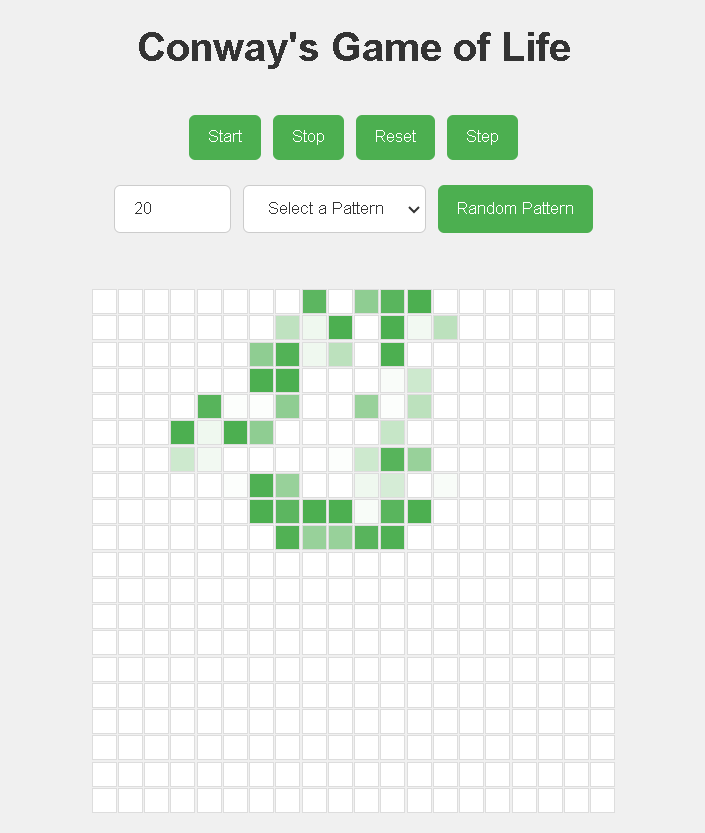

# Conway's Game of Life

## Author: Yuriy Zhvirblis

### Overview

Conway's Game of Life is a cellular automaton devised by the British mathematician John Horton Conway in 1970. It is a zero-player game, meaning that its evolution is determined by its initial state, requiring no further input. The game consists of a grid of cells, each of which can be alive or dead. The state of each cell evolves over discrete time steps according to a set of rules based on the states of its eight neighbors.

### Project Description

This project is an implementation of Conway's Game of Life using Vanilla JavaScript, HTML, and CSS. The goal of this project is to create a dynamic and interactive visualization of the grid, allowing users to set initial states and control the evolution of the grid.

### Features

- **Grid Initialization**: A customizable grid where each cell can be either alive or dead.
- **Game Rules Implementation**: Rules for cell evolution based on the states of neighboring cells.
- **User Interaction**: Users can toggle the state of individual cells by clicking on them.
- **Control Panel**: Start, stop, reset the simulation, and step through the simulation one generation at a time.
- **Visualization**: Clear differentiation between live and dead cells using CSS.
- **Performance Optimization**: Efficient grid updates to handle larger sizes without significant lag.

### Project Structure

conways-game-of-life/
│
├── index.html
├── style.css
└── script.js

### Usage

1. Clone the repository:

   ```bash
   git clone https://github.com/YZvirblis/ConwayGameOfLife.git
   cd conways-game-of-life
   ```

2. Open `index.html` in your web browser to view and interact with the Game.

### Controls

- **Grid Size**: Enter the desired grid size in the input field and press Enter.
- **Start**: Begin the simulation.
- **Stop**: Pause the simulation.
- **Reset**: Clear the grid and reset the simulation.
- **Step**: Progress the simulation by one generation.



### Contributing

Contributions, issues, and feature requests are welcome! Feel free to check the [issues page](https://github.com/YuriyZhvirblis/conways-game-of-life/issues).

### Contact

Yuriy Zhvirblis - [LinkedIn](https://www.linkedin.com/in/yuriy-zvirblis/) - yuriyzdev@gmail.com
